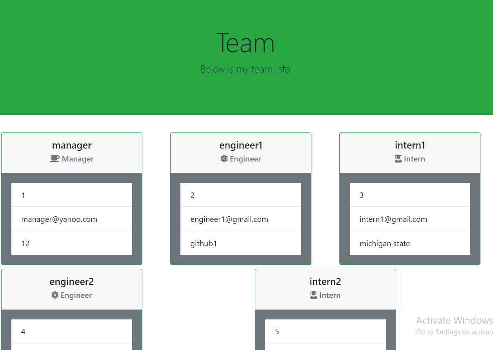

## Team Generator: 
Create an HTML page for your team that is an easy and effecient way to store their information

the link to our page is shown below:
https://jlovejo2.github.io/profile_generator/

## Table of Contents
* [User Story](#user-story)
* [Version 1.0](#version-1.0)
* [The Generated Profile](#the-generated-profile)
* [How To Use](#how-to-use)
* [Apis Used](#apis-used)
* [CSS Framework](#css-framework)
* [Coding Languages Used](#coding-languages-used)
* [Structure of Code and Functions](#structure-of-code-and-functions)
* [Known Issues With Code](#known-issues-with-code)

## User Story
As a user I am a team manager that is trying to create an easy way for me to store my teams information.  This app will start by prompting the team manager for their information and the take them to a menu where they can review their current team, add, edit, or delete team members.  Once they are happy with their team they can render the team info to an html page.

## Version 1.0
* This team generator runs in by entering node index.js in the command.
* Make sure you are in the main folder when running the code on the command line.
* There is no ability to change the scheme of the Html

## The Generated Html Page:
* The Generated html only has one color scheme so far.

Html Layout

 

## How To Use
* The user runs the code by entering "node index.js" in the terminal line while in the main folder.
*  It begins by prompting the team manager for their information.  Name, ID, Email, and office Number
*  After the team manager info is declared they are navigated to a main menu with below options:
    - Review current team
    - Proceed to html render
    - add team member
    - edit team member
    - delete team member
* The user has no limit to the number of team members they can create.
* When finished adding team members the user should pick the "Proceed to html render" option.
* The html file will render as team.html in the folder that index.js is located in.
* Note: currently you can only have one team.html file in the folder.  If the code is run multiple times the results will write over the results in file. 

## Coding Languages Used
* HTML
* CSS
* Javascript
* Node.js

## NPMs Used:
* NPM inquirer
* NPM jest

## CSS Framework:
* Bootstrap

## Structure of Code and Functions
* Assets folder - contains images folder with screenshots for README and images provided with assignment
* lib folder - contains the library of code to run
    - createTeam.js: is the largest javascript file.  It calls the classes created in all the other files and performs all the inquirers, readfileAsynce on htmls, editing of htmls, and rendering of htmls.
    - employee.js - this is the base class that engineer, manager, and intern reference.  It contains code for name, email, and ID
    - engineer.js - this is the base class for the engineer role.  It declares the gitHub username code.
    - manager.js - this is the base class of code for the manager role.
    - intern.js - this is the base class of code for the intern role
* templates - contains the templates for all the html
    - engineer.html
    - intern.html
    - main.html 
    - manager.html
* index.js - javascript file that requires createTeam and then starts the code

## Known Issues With Code
* The delete option does not have full functionality yet.  When a team member is deleted all the information is deleted but the index remains in the array so if you go to review your team it errors out and displays an undefined
* Only one team manager can be created per team.
* createTeam.js is a very large file.  I believe some of the content could be placed in other files to make it smaller.  I ran out of time to clean it up this way.
